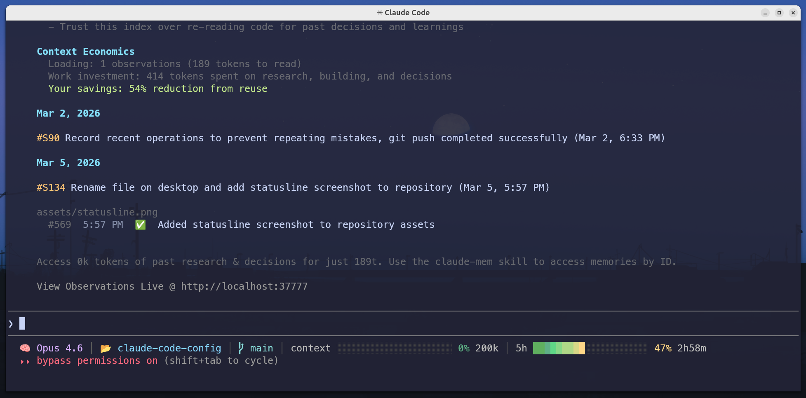

<!-- 翻译同步自 README.md（source of truth）。更新英文版后请同步此文件。 -->

[English](./README.md) | **中文** | [Codex 分支](https://github.com/Mizoreww/awesome-claude-code-config/tree/codex) | [更新日志](./CHANGELOG.zh-CN.md)

# Awesome Claude Code 配置



[Claude Code](https://claude.com/claude-code) 的生产级配置——一键安装全局指令、多语言编码规则（Python / TypeScript / Go）、23 个精选插件、自定义技能（[adversarial-review](https://github.com/poteto/noodle)、paper-reading、[humanizer](https://github.com/blader/humanizer)、[humanizer-zh](https://github.com/op7418/Humanizer-zh)、update-config）、自定义状态栏、MCP 集成，以及跨 session 自动记忆纠正的自我改进循环。

## 展示


**论文阅读技能实战** — 使用 `paper-reading` 技能进行结构化论文分析。查看完整总结：[Attention Is All You Need — 论文总结](docs/Attention_Is_All_You_Need.zh-CN.md)

**对抗式代码审查实战** — 跨模型对抗式代码审查。Claude 通过 Codex CLI 生成多个审查者，分别使用不同批判视角（怀疑者、架构师、极简主义者），合成结构化裁决（PASS / CONTESTED / REJECT）。查看完整展示：[Adversarial Review 效果展示](docs/adversarial-review-showcase.md)

## 目录结构

```
.
├── CLAUDE.md              # 全局指令
├── settings.json          # 设置（权限、插件、hooks、模型）
├── lessons.md             # 自我纠正日志模板（通过 hook 自动加载）
├── rules/                 # 多语言编码标准（common + python/typescript/golang）
├── hooks/                 # 状态栏：渐变进度条（context + 5h 用量）
├── mcp/                   # MCP 服务器配置（Lark-MCP）
├── plugins/               # 插件安装指南（23 个插件，8 个市场）
├── skills/                # 自定义技能（adversarial-review、paper-reading、humanizer、humanizer-zh、update-config）
├── docs/                  # 论文阅读总结
├── images/                # 展示截图
├── VERSION                # 语义化版本号
├── install.sh             # 一键安装脚本（macOS / Linux）
└── install.ps1            # 一键安装脚本（Windows PowerShell）
```

## 快速开始

### macOS / Linux

**一行远程安装**（无需 clone）：

```bash
bash <(curl -fsSL https://raw.githubusercontent.com/Mizoreww/awesome-claude-code-config/main/install.sh)
```

自动弹出交互式选择器。添加 `--all` 可跳过选择直接安装全部。

**本地安装**（从 clone）：

```bash
git clone https://github.com/Mizoreww/awesome-claude-code-config.git
cd awesome-claude-code-config
./install.sh              # 交互式选择器
./install.sh --all        # 安装全部（非交互）
```

### Windows

**一行远程安装**（PowerShell，无需 clone）：

```powershell
irm https://raw.githubusercontent.com/Mizoreww/awesome-claude-code-config/main/install.ps1 | iex
```

自动弹出交互式选择器。如需非交互安装全部，请从本地 clone 运行 `.\install.ps1 -All`。

**CMD 环境**：

```cmd
powershell -c "irm https://raw.githubusercontent.com/Mizoreww/awesome-claude-code-config/main/install.ps1 | iex"
```

**本地安装**（从 clone）：

```powershell
git clone https://github.com/Mizoreww/awesome-claude-code-config.git
cd awesome-claude-code-config
.\install.ps1             # 交互式选择器
```

### 交互式安装

直接运行 `./install.sh`（不带参数）会启动交互式二级菜单，自由选择要安装的组件。语言规则和重型插件**默认关闭**，减少上下文占用：

```
  ━━━━━━━━━━━━━━━━━━━━━━━━━━━━━━━━━━━━━━━━━━━━━━━━━━━
    Awesome Claude Code Config Installer  2.2.0
  ━━━━━━━━━━━━━━━━━━━━━━━━━━━━━━━━━━━━━━━━━━━━━━━━━━━

  ↑/↓ Navigate   Enter Open   a All  n None  d Defaults  q Quit

  > [5/5] Core                    全局指令、设置、规则...
    [0/3] Language Rules           Python / TypeScript / Go
    [2/3] Review                   code-review 插件 + 对抗式审查
    [3/4] Skills                   paper-reading, humanizer, update-config...
    [11/11] Plugins — Official     superpowers, context7, playwright...
    [0/3] Plugins — Community      claude-mem, claude-health, PUA
    [0/6] Plugins — AI Research    fine-tuning, inference, optimization...
    [0/1] MCP Servers              Lark/飞书

     [ Submit ]
```

**二级菜单**：用 ↑↓ 浏览分组，Enter 打开子菜单选择具体项目，Space 切换开关。

**Review** 分组可在 [adversarial-review](https://github.com/poteto/noodle)（跨模型，派 Codex 审查者）和 [Codex adversarial-review](https://github.com/openai/codex-plugin-cc)（Codex 插件内置）之间选择，二者**互斥**——选中一个自动取消另一个。

### 菜单分组

| 分组 | 项目 | 默认 |
|------|------|------|
| Core (5) | CLAUDE.md、settings.json、Common rules、StatusLine、Lessons | 全部开启 |
| Language Rules (3) | Python、TypeScript、Go | 全部关闭 |
| Review (3) | code-review 插件、adversarial-review、Codex adversarial-review | code-review + adversarial-review 开启 |
| Skills (4) | paper-reading、humanizer、humanizer-zh、update-config | humanizer-zh 关闭，其余开启 |
| Plugins — Official (11) | superpowers、context7、commit-commands、document-skills、playwright、feature-dev、code-simplifier、ralph-loop、frontend-design、example-skills、github | 全部开启 |
| Plugins — Community (3) | claude-mem、claude-health、PUA | 全部关闭 |
| Plugins — AI Research (6) | tokenization、fine-tuning、post-training、inference-serving、distributed-training、optimization | 全部关闭 |
| MCP Servers (1) | Lark MCP server | 关闭 |

### CLI 参数

```bash
# Bash（macOS / Linux）
./install.sh              # 交互式选择器（自由选择要安装的组件）
./install.sh --all        # 安装全部（非交互）
./install.sh --dry-run    # 预览会安装什么
./install.sh --uninstall  # 删除全部
./install.sh --version    # 显示版本信息
```

```powershell
# PowerShell（Windows）
.\install.ps1              # 交互式选择器
.\install.ps1 -All         # 安装全部（非交互）
.\install.ps1 -Uninstall   # 删除全部
.\install.ps1 -Version     # 显示版本信息
```

### 卸载

```bash
./install.sh --uninstall          # 删除全部（含插件和 MCP）
./install.sh --uninstall --force  # 跳过确认（CI/非交互环境）
```

```powershell
.\install.ps1 -Uninstall         # 删除全部（含插件和 MCP）
.\install.ps1 -Uninstall -Force  # 跳过确认
```

### 版本信息

```bash
./install.sh --version                  # 显示源版本 / 已安装版本 / 远程最新版本
```

```powershell
.\install.ps1 -Version                  # 显示源版本 / 已安装版本 / 远程最新版本
```

## 核心特性

### 自我改进循环

双层记忆，按作用域路由：

1. 用户纠正 Claude → Claude 判断作用域：**跨项目通用**的纠正写入 `~/.claude/lessons.md`；**仅当前项目**的偏好写入项目的 `MEMORY.md`
2. 下次 session → `SessionStart` hook 自动注入全局 lessons；项目 `MEMORY.md` 由 Claude Code 自动加载
3. 模式确认后 → 规则提升至 `CLAUDE.md`

### SessionStart Hook

`settings.json` 中配置了两个 `SessionStart` hook：
- **startup**：新 session 启动时注入 lessons.md
- **compact**：上下文压缩后重新注入 lessons.md

取代了以前在 CLAUDE.md 中要求手动 Read lessons.md 的方式（更可靠）。

### 状态栏

单行状态栏，渐变进度条，由 `hooks/statusline.sh` 驱动：

- **模型** + **目录** + **虚拟环境**（conda/venv/poetry/pipenv） + **git 分支**
- **Context 窗口**：渐变进度条（绿 → 黄 → 红），显示百分比和大小
- **5 小时用量**：从 `api.anthropic.com/api/oauth/usage` 拉取（60s 缓存），显示重置倒计时
- 进度条固定 20 字符宽，16 级颜色渐变

通过 `settings.json` 中的 `statusLine` 配置：

```json
"statusLine": {
  "type": "command",
  "command": "bash $HOME/.claude/hooks/statusline.sh"
}
```

### settings.json 智能合并

当 `settings.json` 已存在时，安装器会执行智能合并（Bash 版需要 `jq`，PowerShell 版使用内置 JSON 支持）：

- **env**：新值作为默认值，已有值优先
- **permissions.allow**：两个数组取并集（去重）
- **enabledPlugins**：取并集（新插件自动加入，已有配置保留）
- **hooks.SessionStart**：按 `matcher` 字段去重
- **statusLine**：新配置优先

没有 `jq` 时，会显示手动合并提示。

### 分层规则

```
common/       → 通用原则（始终加载）
  ↓ extended by
python/       → PEP 8、pytest、black、bandit
typescript/   → Zod、Playwright、Prettier
golang/       → gofmt、表驱动测试、gosec
```

### 插件优先

23 个插件，8 个 marketplace。每个插件都可在二级交互菜单中单独选择：

**Plugins — Official**（11 个）— 默认安装：

| 插件 | 市场 | 功能 |
|------|------|------|
| [**superpowers**](https://github.com/obra/superpowers) | claude-plugins-official | 头脑风暴、调试、代码审查、Git worktree、计划编写 |
| [**everything-claude-code**](https://github.com/affaan-m/everything-claude-code) | everything-claude-code | TDD、安全审查、数据库模式、Go/Python/Spring Boot |
| [**document-skills**](https://github.com/anthropics/skills) | anthropic-agent-skills | PDF、DOCX、PPTX、XLSX 创建和操作 |
| [**example-skills**](https://github.com/anthropics/skills) | anthropic-agent-skills | 前端设计、MCP 构建器、画布设计、算法艺术 |
| **frontend-design** | claude-plugins-official | 生产级前端界面设计 |
| [**context7**](https://github.com/upstash/context7) | claude-plugins-official | 最新库文档查询 |
| [**github**](https://github.com/github/github-mcp-server) | claude-plugins-official | GitHub 集成（Issue、PR、工作流） |
| [**playwright**](https://github.com/microsoft/playwright-mcp) | claude-plugins-official | 浏览器自动化、E2E 测试、截图 |
| **feature-dev** | claude-plugins-official | 引导式功能开发 |
| **code-simplifier** | claude-plugins-official | 代码简化和重构 |
| **ralph-loop** | claude-plugins-official | 会话感知 AI 助手 REPL |
| **commit-commands** | claude-plugins-official | Git 提交、清理分支、提交-推送-PR |

**Review**（3 个）— 默认开启 code-review + adversarial-review（adversarial-review 与 Codex 互斥）：

| 插件/技能 | 来源 | 功能 |
|-----------|------|------|
| **code-review** | claude-plugins-official | 基于置信度的 PR 代码审查 |
| [**adversarial-review**](https://github.com/poteto/noodle) | skill（内置） | 跨模型对抗式审查 — 在对立模型上生成审查者，使用不同批判视角 |
| [**codex**](https://github.com/openai/codex-plugin-cc) | openai-codex | Codex 插件内置对抗式审查和 CLI 集成 |

**Plugins — Community**（3 个）— 在交互式菜单中选择，或通过 `--all` 安装：

| 插件 | 市场 | 功能 |
|------|------|------|
| [**claude-mem**](https://github.com/thedotmack/claude-mem) | thedotmack | 持久化记忆，智能搜索、时间线、AST 感知代码搜索 |
| [**health**](https://github.com/tw93/claude-health) | claude-health | Claude Code 会话健康检查和状态面板 |
| [**pua**](https://github.com/tanweai/pua) | pua-skills | AI Agent 生产力倍增器 — 强制穷举式问题解决，支持中/英/日多语言 |

**Plugins — AI Research**（6 个）— 在交互式菜单中选择，或通过 `--all` 安装：

| 插件 | 市场 | 功能 |
|------|------|------|
| [**tokenization**](https://github.com/Orchestra-Research/AI-Research-SKILLs) | ai-research-skills | HuggingFace Tokenizers、SentencePiece |
| [**fine-tuning**](https://github.com/Orchestra-Research/AI-Research-SKILLs) | ai-research-skills | Axolotl、LLaMA-Factory、PEFT、Unsloth |
| [**post-training**](https://github.com/Orchestra-Research/AI-Research-SKILLs) | ai-research-skills | GRPO、RLHF、DPO、SimPO |
| [**inference-serving**](https://github.com/Orchestra-Research/AI-Research-SKILLs) | ai-research-skills | vLLM、SGLang、TensorRT-LLM、llama.cpp |
| [**distributed-training**](https://github.com/Orchestra-Research/AI-Research-SKILLs) | ai-research-skills | DeepSpeed、FSDP、Megatron-Core、Ray Train |
| [**optimization**](https://github.com/Orchestra-Research/AI-Research-SKILLs) | ai-research-skills | AWQ、GPTQ、GGUF、Flash Attention、bitsandbytes |

详见 [`plugins/README.md`](plugins/README.md) 了解安装方式。

### 版本变更日志策略

CLAUDE.md 包含 **版本变更日志** 规则：在做版本级改动（新功能、重大重构、Breaking Change）时，Claude 会主动在项目根目录维护 `CHANGELOG.md`，每条记录包含功能、设计理念和注意细节。使设计决策与代码同步可追溯。

### 自定义技能

| 技能 | 说明 |
|------|------|
| **[adversarial-review](https://github.com/poteto/noodle)** | 跨模型对抗式代码审查。在对立模型上生成 1-3 个审查者（Claude 派 Codex，Codex 派 Claude），使用不同批判视角（怀疑者、架构师、极简主义者），合成结构化裁决（PASS / CONTESTED / REJECT）。 |
| **paper-reading** | 结构化论文阅读与总结，自动提取关键图表。纯 PDF 流程，使用 pymupdf4llm 精确提取图片/矢量图/表格（无需 ar5iv/Playwright），输出标准化 Markdown（问题、方法、实验、洞见）。 |
| **[humanizer](https://github.com/blader/humanizer)** | 检测并去除文本中的 AI 写作痕迹。基于维基百科"AI 写作特征"指南，识别内容、语言、风格、沟通 4 大类共 24 种模式（意义膨胀、AI 高频词、破折号滥用、谄媚语气等），将文本改写为自然人类风格。 |
| **[humanizer-zh](https://github.com/op7418/Humanizer-zh)** | humanizer 中文版。检测并去除中文文本中的 AI 生成痕迹，使其更自然、更像人类书写。 |
| **update-config** | Session 内更新命令。在 Claude Code 中输入 `/update-config` 即可检查新版本并重新运行交互式安装器，无需离开当前会话。 |

自定义技能放在 `skills/<name>/SKILL.md`。

### 对抗式代码审查

CLAUDE.md 包含 **Code Review** 规则：无论是用户要求还是 skill（如 `code-reviewer`、`simplify`）触发的代码审查，Claude 都会调用安装时选择的审查工具。**Review** 菜单分组提供两个选项：

- **[adversarial-review](https://github.com/poteto/noodle)**（默认）：跨模型审查，在对立模型上生成审查者，使用不同批判视角（怀疑者、架构师、极简主义者）。需要安装 `codex` CLI。不可用时回退到 `code-reviewer` agent。
- **[Codex adversarial-review](https://github.com/openai/codex-plugin-cc)**：Codex 插件内置审查。需要设置 `OPENAI_API_KEY` 环境变量。不可用时回退到 `code-reviewer` agent。

两个选项互斥。安装器根据选择动态配置 CLAUDE.md，包含回退行为。

## 安全提示

`settings.json` 现在默认使用 `auto` 模式（需要 Claude Code >= 2.1.80，[2026-03-24 发布](https://docs.anthropic.com/en/docs/claude-code)）。Auto 模式允许 Claude 自动批准安全操作，同时拦截高风险操作——比 `bypassPermissions` 更安全。安装器会自动检测 Claude Code 版本，旧版本自动降级为 `bypassPermissions`。如需其他模式，修改 `settings.json` 中 `defaultMode` 为 `"default"`、`"acceptEdits"` 或 `"bypassPermissions"`。

## 自定义

- **添加语言**：创建 `rules/<lang>/` 目录，扩展 common 规则
- **添加技能**：放到 `skills/<name>/SKILL.md`
- **调整 CLAUDE.md**：根据你的 shell、包管理器、项目上下文定制

## 致谢

- [**Claude Code in Action**](https://anthropic.skilljar.com/claude-code-in-action) by Anthropic Academy — 官方课程，涵盖 Claude Code 工具集成、MCP 服务器、GitHub 自动化等开发工作流
- [**我给 10 个 Claude Code 打工**](https://mp.weixin.qq.com/s/9qPD3gXj3HLmrKC64Q6fbQ) by 胡渊明 — 多 Claude Code 实例并行协作的实践经验分享
- [**Harness Engineering**](https://openai.com/zh-Hans-CN/index/harness-engineering/) by OpenAI — "驾驭工程"理念：工程师从代码编写者转变为系统设计者，用 Agent 生成百万行代码
- [**Anthropic Engineering**](https://www.anthropic.com/engineering) by Anthropic — 工程博客，涵盖 Agent 开发、评估方法与构建可靠 AI 系统
- [**OpenAI Engineering**](https://openai.com/news/engineering/) by OpenAI — 工程博客，分享构建和扩展 AI 系统的技术洞察
- [**Claude Code Best Practice**](https://github.com/shanraisshan/claude-code-best-practice) by shanraisshan — Claude Code 最佳实践、工作流与实现模式的全面知识库
- [**Claude How To**](https://github.com/luongnv89/claude-howto) by luongnv89 — 通过渐进式教程掌握 Claude Code 的实例驱动指南，含可直接复用的模板

## 许可证

MIT
